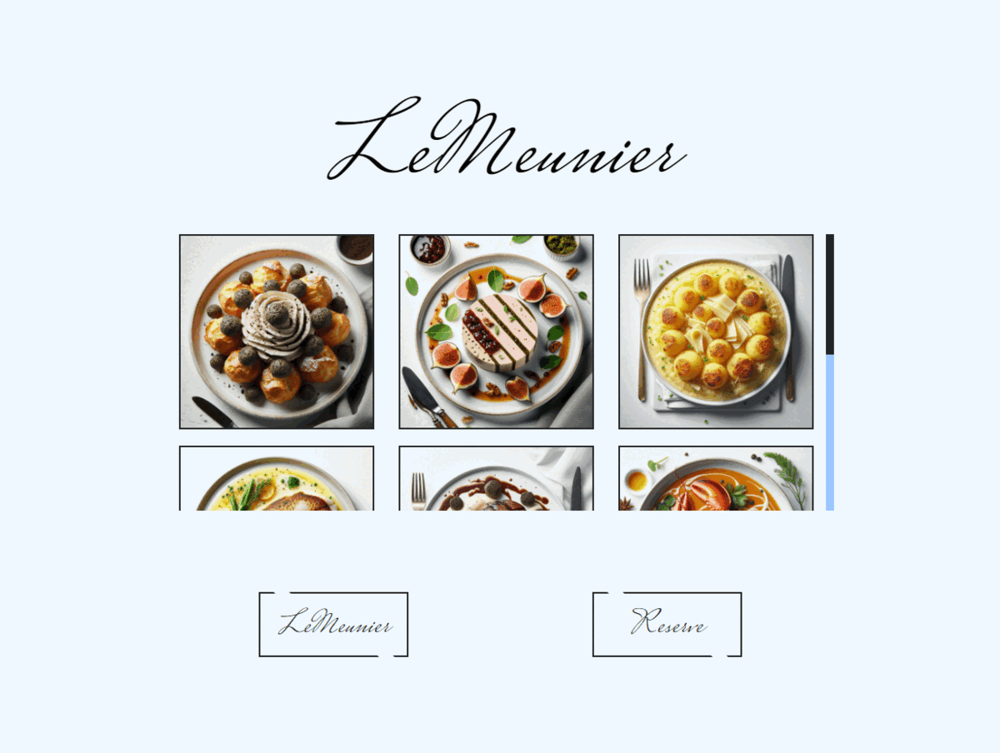

# LeMeunier 🍲

¡Welcome all to LeMeunier restaurant webside! This the Week One and my first project at GeeksHubs Academy, consisting in a landing page, menu and reservation/contact page.

## 🚀 GitHub pages prevew

You can get a prevew of the webside on the actions tab in GitHub or directly through this [link](https://hypoldev.github.io/Menu_Week-1-Project/).

## 🛠️ Tech&Tolls used 

## 🏙️ Images and Resources

- **ChatGPT-3.5 from OpenIA** - Responsible for most of the menu description aswell as dish selection.
- **Bing IA** - Responsible for the creation of the dish images used on the webside.

Both of them open to public use in the Terms and Conditions of its parent companies.

## ✒️ Autor

- **Pol Montero** - Project Developer
  - [GitHub](https://github.com/hypoldev) 

## 🎓 Special Thanks

- To **Geekshubs Academy** for the trust and encouragement to develop this first project (1/12 i suppose).

- To **Pedro Gardim** for such an awesome README inspiration.
-  To **Sergio Torres** for encouraging simpleness and minimalism([the inspiration](https://github.com/SergioTorresGarcia/Proyecto1-CartaRestaurante)).

## 📄 Add Ons - Bugs and Dreams

Project finished on a polishing state, it is posible to find bugs, probably with the "reservation" page buttons.
I'm no graphic designer to this date however I still belive the styling of this web complex can be perfected with minimal changes, and I encourarge you to perform them.
